# Practice Dashboard — Complete Website Flow Analysis

> **Project:** AI-Powered Remote Patient Monitoring Dashboard  
> **Stack:** Next.js (App Router), Zustand, TypeScript, Tailwind CSS, shadcn/ui  
> **Generated:** Feb 24, 2026

---

## Table of Contents

1. [Architecture Overview](#1-architecture-overview)
2. [Current Website Flow](#2-current-website-flow)
3. [Nurse Flow](#3-nurse-flow)
4. [Doctor Flow](#4-doctor-flow)
5. [Patient Flow](#5-patient-flow)
6. [EWS Overall Escalation Flow](#6-ews-overall-escalation-flow)
7. [Enterprise Platform Architecture](#7-enterprise-platform-architecture)
8. [Best Flow Recommendations](#8-best-flow-recommendations)

---

## 1. Architecture Overview

### Pages

| Route       | File                    | Purpose                       |
| ----------- | ----------------------- | ----------------------------- |
| `/`         | `app/page.tsx`          | Main dashboard — Patient list |
| `/phr/[id]` | `app/phr/[id]/page.tsx` | Standalone PHR detail page    |

### Components

| Component         | File                               | Purpose                                                                                    |
| ----------------- | ---------------------------------- | ------------------------------------------------------------------------------------------ |
| `SiteHeader`      | `components/site-header.tsx`       | Top bar + nav (Dashboard, Command Center, Messages, Users, Reports, Settings, Escalations) |
| `PracticeHeader`  | `components/practice-header.tsx`   | Patient list toolbar (search, add, refresh, View PHR button)                               |
| `PatientTable`    | `components/patient-table.tsx`     | Patient list table with EWS scores, status, trends (opens PHR modal on "View PHR")         |
| `PhrDisplay`      | `components/phr-display.tsx`       | PHR modal — Patient profile, vitals, differential diagnosis, timeline                      |
| `PhrModalDetails` | `components/phr-modal-details.tsx` | Deep-dive modals — AI assessment, treatment plans, emergency protocols                     |

### State Management (Zustand Stores)

| Store            | Key Data                                                                  |
| ---------------- | ------------------------------------------------------------------------- |
| `patient-store`  | Patient list, selected patient ID, PHR modal open/close                   |
| `phr-store`      | PHR records (profile, EWS, metrics, timeline, diagnosis, treatment plans) |
| `practice-store` | Practice/clinic records (not actively used in current UI)                 |

### Data (3 Patients with PHR Data)

| ID  | Patient             | EWS | Status    | Scenario                                               |
| --- | ------------------- | --- | --------- | ------------------------------------------------------ |
| 1   | William Davis (75)  | 11  | CRITICAL  | COPD exacerbation — AI auto-escalated to ER            |
| 2   | Robert Johnson (68) | 7   | High Risk | Heart failure — AI symptom call → Nurse → Doctor       |
| 3   | Kylie James (32)    | 9   | CRITICAL  | Meningitis risk — Patient-initiated symptom check → ER |

---

## 2. Current Website Flow

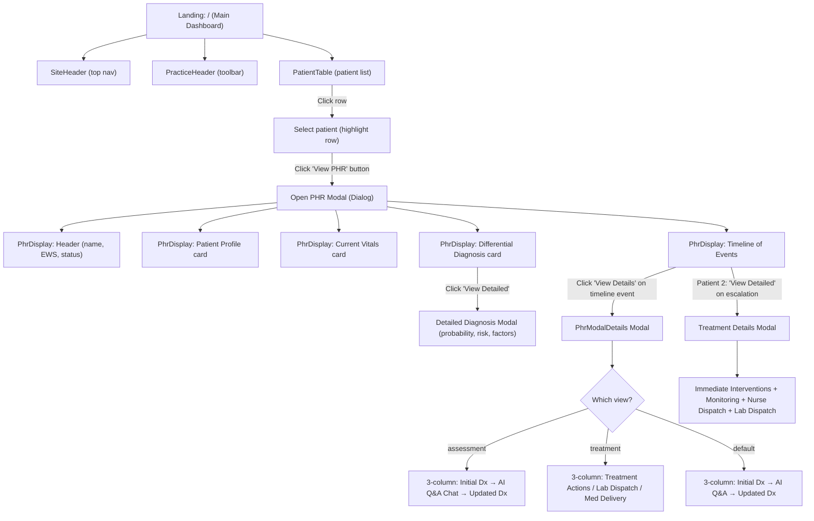

---

## 3. Nurse Flow

### Current Flow (as implemented)

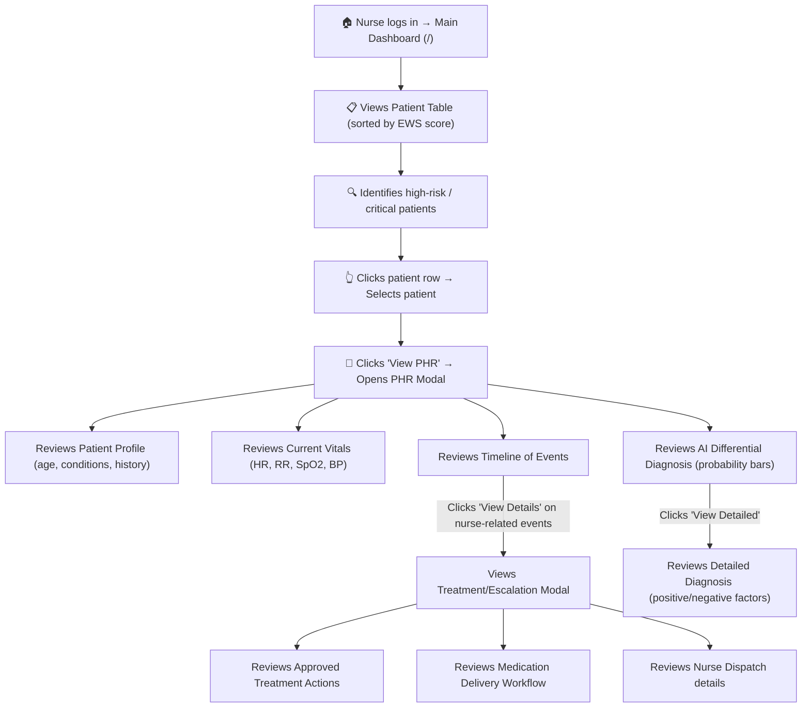

### Nurse's Key Touchpoints

1. **Patient Triage** — View patient table, identify by EWS score & status badges
2. **PHR Review** — Open modal to see full patient profile and vitals
3. **Timeline Review** — See chronological events, including AI calls and escalations
4. **Treatment Execution** — View treatment plans, nurse dispatch assignments, medication delivery workflow
5. **Escalation** — See cases escalated TO the nurse (from AI) and cases nurse escalates UP (to doctor/ER)

### Scenarios by Patient

| Patient                    | Nurse Role                                                                                         |
| -------------------------- | -------------------------------------------------------------------------------------------------- |
| William Davis (CRITICAL)   | Nurse receives AI escalation → dispatches emergency services → performs clinical handoff           |
| Robert Johnson (High Risk) | Nurse Sarah joins AI call → assesses fluid overload → messages Dr. Patel → executes treatment plan |
| Kylie James (CRITICAL)     | Nurse escalation: immediate ER referral → monitors vitals en route → neuro checks q15min           |

---

## 4. Doctor Flow

### Current Flow (as implemented)

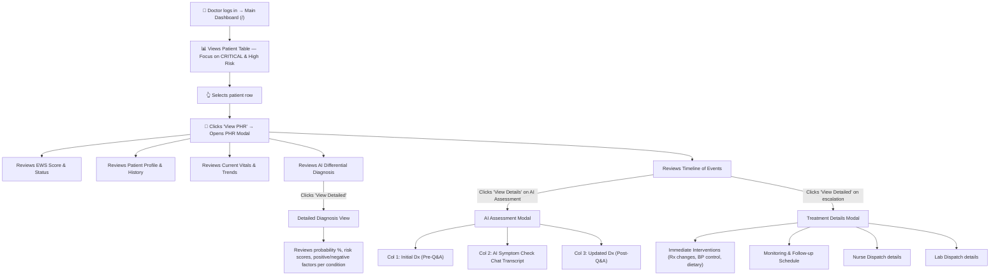

### Doctor's Key Touchpoints

1. **Dashboard Overview** — Scan all patients, focus on highest EWS scores
2. **Clinical Decision Support** — Review AI-generated differential diagnosis with evidence
3. **AI-Patient Interaction Review** — Read symptom checker transcripts to assess quality of AI triage
4. **Treatment Planning** — Review/approve treatment details (medications, labs, monitoring)
5. **Dispatch Review** — Verify nurse and lab dispatch assignments and schedules

### Scenarios by Patient

| Patient                    | Doctor Role                                                                                                                         |
| -------------------------- | ----------------------------------------------------------------------------------------------------------------------------------- |
| William Davis (CRITICAL)   | Reviews emergency protocol activation, verifies ER triage notification and clinical handoff data                                    |
| Robert Johnson (High Risk) | Receives escalation from nurse, reviews AI assessment, approves treatment (increase diuretics, order labs), sets follow-up schedule |
| Kylie James (CRITICAL)     | Reviews AI meningitis assessment, verifies ER transport dispatch, reviews clinical handoff data                                     |

---

## 5. Patient Flow

### Current Flow (as implemented)

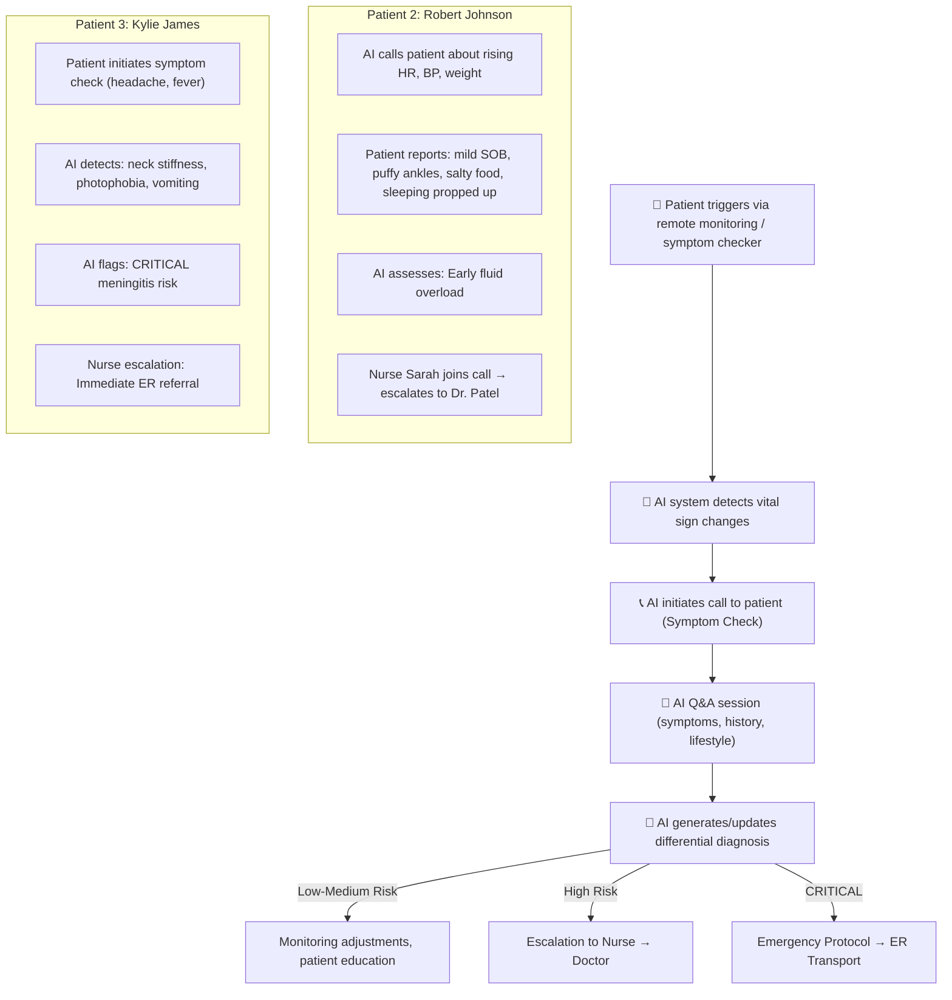

### Patient's Key Touchpoints (Indirect — via AI)

1. **Remote Monitoring** — Vitals automatically collected (HR, BP, SpO2, weight, etc.)
2. **AI Symptom Check Call** — AI initiates or patient initiates a symptom assessment call
3. **Q&A Interaction** — AI asks targeted questions, patient responds
4. **Escalation Notification** — Patient is informed of nurse/doctor involvement
5. **Treatment Outcomes** — Nurse home visit, lab tech home visit, medication delivery

---

## 6. EWS Overall Escalation Flow

> The **Early Warning Score (EWS)** is the core engine driving the entire system. This is the end-to-end flow from vitals collection to patient outcome.

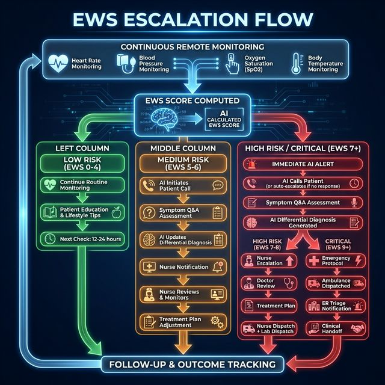

### How It Works — Step by Step

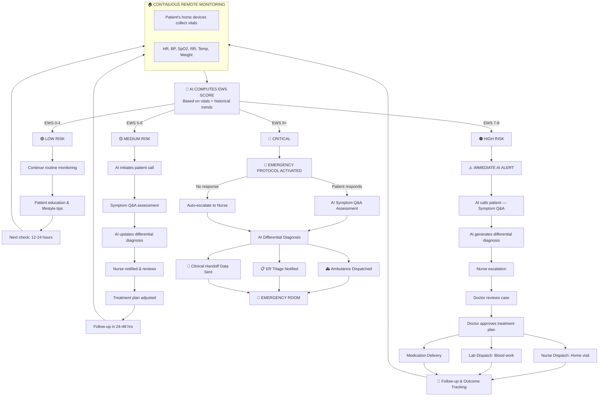

### EWS Score Ranges & Actions

| EWS Score | Risk Level  | Color     | System Action                               | Human Involvement                                   |
| --------- | ----------- | --------- | ------------------------------------------- | --------------------------------------------------- |
| **0 – 4** | Low Risk    | 🟢 Green  | Continue monitoring, patient education      | None required                                       |
| **5 – 6** | Medium Risk | 🟡 Yellow | AI calls patient, symptom Q&A               | Nurse notified, reviews findings                    |
| **7 – 8** | High Risk   | 🟠 Orange | Immediate AI alert, full symptom assessment | Nurse escalates → Doctor reviews → Treatment plan   |
| **9+**    | Critical    | 🔴 Red    | Emergency protocol activated                | Ambulance dispatched, ER notified, clinical handoff |

### Real Examples from the Dashboard

| Patient                 | EWS    | Trigger                             | AI Action                                 | Escalation Path                           | Outcome                                                          |
| ----------------------- | ------ | ----------------------------------- | ----------------------------------------- | ----------------------------------------- | ---------------------------------------------------------------- |
| **William Davis** (75)  | **11** | HR 124, SpO2 88%, RR 28             | AI called — no response (disoriented)     | AI → Nurse → Emergency Services           | 🚑 Ambulance dispatched, ER triage notified, clinical handoff    |
| **Robert Johnson** (68) | **7**  | HR 102, BP 148/92, Weight +2.5 lbs  | AI called patient — symptom Q&A completed | AI → Nurse Sarah → Dr. Patel              | 💊 Diuretics increased, labs ordered, nurse home visit scheduled |
| **Kylie James** (32)    | **9**  | Temp 102.3°F, HR 115, headache 8/10 | Patient initiated symptom check           | AI flags meningitis → Nurse → ER referral | 🚑 Ambulance dispatched, meningitis protocol activated           |

---

## 7. Enterprise Platform Architecture

> How enterprise-grade RPM platforms (Epic, Philips, Biofourmis, etc.) manage patient monitoring at scale.

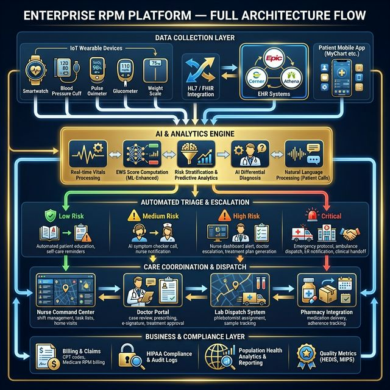

### 5 Layers of an Enterprise RPM Platform

| Layer                        | What It Does                                           | Key Systems                                                                            |
| ---------------------------- | ------------------------------------------------------ | -------------------------------------------------------------------------------------- |
| **1. Data Collection**       | Collects vitals from patient devices & EHR systems     | IoT wearables, HL7/FHIR, Epic/Cerner, Patient App (MyChart)                            |
| **2. AI & Analytics Engine** | Processes vitals, computes EWS, predicts deterioration | ML-enhanced EWS, Risk stratification, NLP for patient calls, AI differential diagnosis |
| **3. Automated Triage**      | Routes patients by severity into escalation workflows  | Low → education, Medium → AI call, High → nurse+doctor, Critical → ER                  |
| **4. Care Coordination**     | Manages all human actions triggered by the system      | Nurse command center, Doctor portal (e-prescribe), Lab dispatch, Pharmacy integration  |
| **5. Business & Compliance** | Handles revenue, legal, and population health          | CPT billing, HIPAA audit logs, Population analytics, HEDIS/MIPS quality metrics        |

### Your Dashboard vs Enterprise Platforms

| Feature                    | Your Dashboard | Enterprise (Epic/Philips/Biofourmis) |
| -------------------------- | :------------: | :----------------------------------: |
| EWS Score                  |       ✅       |           ✅ + ML-enhanced           |
| AI Symptom Checker         |       ✅       |               ⚠️ Rare                |
| AI Differential Diagnosis  |       ✅       |  ❌ Rare — **your differentiator**   |
| Nurse Escalation           |       ✅       |           ✅ + paging/SMS            |
| Doctor Review              |  ✅ read-only  |       ✅ + e-prescribe, e-sign       |
| Patient Portal             |       ❌       |           ✅ MyChart etc.            |
| EHR Integration (HL7/FHIR) |       ❌       |                  ✅                  |
| Lab/Nurse Dispatch         |    ✅ in UI    |          ✅ + GPS tracking           |
| Billing & Claims           |       ❌       |           ✅ CPT/Medicare            |
| HIPAA Compliance           |       ❌       |                  ✅                  |

> [!TIP]
> Your **AI Differential Diagnosis** and **AI Symptom Checker** features are ahead of most enterprise platforms. These are your biggest competitive advantages.

---

## 8. Best Flow Recommendations

---

### 🩺 Best Doctor Flow (Recommended)

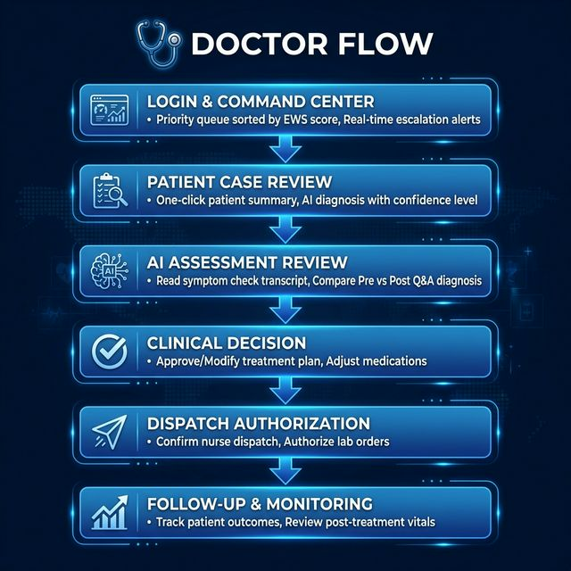

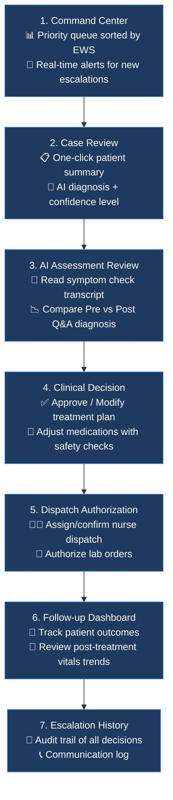

**What's Missing (Suggestions to Add):**

- **Priority queue / Command Center** — A dedicated escalation inbox showing only cases that need doctor attention, sorted by urgency
- **Approve/Reject Treatment** — Interactive treatment plan approval (not just read-only view)
- **Prescribing Interface** — Inline medication adjustment with drug interaction checks
- **Follow-up Tracker** — Post-treatment outcome dashboard showing patient response to interventions
- **Doctor-to-Doctor Consult** — Ability to request specialist consultation directly

---

### 👩‍⚕️ Best Nurse Flow (Recommended)

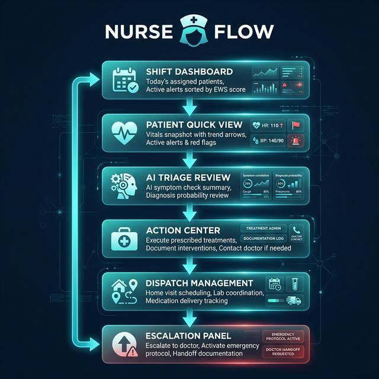

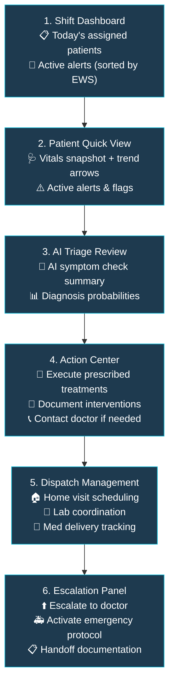

**What's Missing (Suggestions to Add):**

- **Task/Checklist System** — Interactive checklist for nurse to mark completed interventions
- **Real-time AI Co-pilot** — Live AI assistance during patient calls (suggested questions, risk flags)
- **Shift Handoff** — Structured handoff notes for the next nurse shift
- **Direct Messaging** — In-app messaging to doctors, lab techs, and patients
- **Home Visit Tracker** — Map-based view of scheduled home visits with patient locations

---

### 🧑‍💻 Best Patient Flow (Recommended)

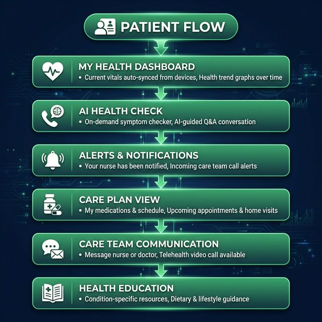

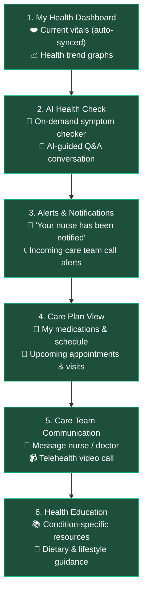

**What's Missing (Suggestions to Add):**

- **Patient-Facing App/Portal** — Currently no patient-facing UI exists; patients experience the system only through AI phone calls
- **My Health Dashboard** — Self-service vitals view with trends and personal health record
- **Symptom Checker UI** — Web/mobile interface for patient-initiated symptom checks (not just phone call)
- **Appointment & Visit Tracker** — View upcoming nurse home visits, lab visits, doctor appointments
- **Medication Reminders** — Push notifications / SMS for medication adherence
- **Care Plan Education** — Personalized health content based on diagnosed conditions

---

## Summary of Gaps & Priorities

| Priority  | Feature                               | Affects   | Impact                                            |
| --------- | ------------------------------------- | --------- | ------------------------------------------------- |
| 🔴 High   | Priority Escalation Inbox for Doctors | Doctor    | Reduces time-to-action on critical cases          |
| 🔴 High   | Interactive Treatment Approval        | Doctor    | Enables doctors to approve/modify plans inline    |
| 🔴 High   | Nurse Task Checklist                  | Nurse     | Tracks intervention completion and accountability |
| 🟡 Medium | Patient-Facing Portal                 | Patient   | Empowers patients with health visibility          |
| 🟡 Medium | Real-time Notifications/Alerts        | All roles | Ensures timely response to changes                |
| 🟡 Medium | Messaging System                      | All roles | Enables direct communication between roles        |
| 🟢 Low    | Shift Handoff Notes                   | Nurse     | Improves continuity of care between shifts        |
| 🟢 Low    | Health Education Portal               | Patient   | Improves patient engagement and compliance        |
| 🟢 Low    | Analytics/Reports Dashboard           | Doctor    | Tracks population-level trends                    |
