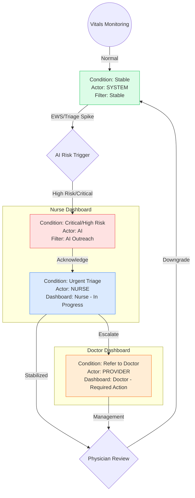

# Clinical Governance: Patient Condition Management

As an MBBS (Physician) and Senior Nurse, we view the "Condition" field not just as a data point, but as a **clinical directive**. It dictates the resource allocation, frequency of monitoring, and escalation urgency.

## 1. Hierarchy of Control (Who can change it?)

### A. The AI / System (Real-Time Vigilance)
- **Role:** Automation and 24/7 surveillance.
- **Permission:** **Upgrade Only**. The system should have the authority to upgrade a condition (e.g., Stable → High Risk) based on EWS/Triage thresholds.
- **Safety Rule:** The system should **never** independently downgrade a condition that was manually set by a human or reached a 'Critical' peak without explicit human verification.

### B. The Clinical Nurse (Operational Frontline)
- **Role:** Direct observation and implementation of care.
- **Permission:** **Immediate Override**. Nurses can upgrade a condition based on "Clinical Intuition" (e.g., patient is tachypneic and looks pale, despite vitals being borderline).
- **Responsibility:** Validating AI alerts. If the AI triggers "Critical" due to a loose SpO2 sensor, the nurse is the primary filter to correct the status to "Stable".

### C. The Physician / Provider (MBBS) (Diagnostic Authority)
- **Role:** Management and discharge/downgrade authority.
- **Permission:** **Final Stabilization**. Physicians typically make the definitive call to move a patient from "High Risk" back to "Stable" after reviewing the treatment trajectory and results.

---

## 2. Critical Edge Cases & Analysis

### Case 1: The "Transient Peak" (Numerical vs. Clinical Stability)
- **Scenario:** A patient’s AI Triage score hits 92 (Critical) for 5 minutes during a coughing fit, then drops to 45 (Medium Risk).
- **Analysis:** From a nursing perspective, this isn't "Stable". It's a "Recovered Critical".
- **Rule:** The patient must remain in the **Needs Action** queue. The "Peak" score (92) is the primary driver for condition until a human performs a physical assessment.

### Case 2: The "Silent Deteriorator"
- **Scenario:** Vitals are within normal limits (WNL), but the AI detects a downward trend in SpO2 and an upward trend in RR.
- **Analysis:** The AI sees what the human eye misses over 8 hours. 
- **Rule:** AI should trigger a "Low/Medium Risk" condition even if EWS is technically 0. This is the transition from reactive to proactive care.

### Case 3: Technical Artifacts (The "False Alarm")
- **Scenario:** An infant kicks off a lead, or an adult drinks cold water before a temp check.
- **Analysis:** This causes a "Critical" spike that is technically incorrect.
- **Rule:** "Changer Name" becomes vital here. If "Nurse Emma" changes the condition back to "Stable" within 2 minutes of an AI "Critical" alert, the audit trail must show this was a human override of an AI artifact.

### Case 4: The "Stabilizing Critical" (The Governance Gap)
- **Scenario:** Patient is under "Emergency Protocol". Treatment is successful. Vitals are now perfect.
- **Analysis:** Who moves them back? If a Nurse does it, they take clinical liability. If the System does it, it's unsafe.
- **Rule:** Only a "Provider" role should have the authority to move a patient out of "Critical" status to "Stable", whereas "High Risk" can be managed by "Nurse" role.

---

## 3. Summary of Audit requirements

To maintain clinical safety, every condition change must capture:
1. **Triggering Metric:** (Was it the EWS, the AI Score, or Subjective observation?)
2. **Authority:** (Nurse Name vs AI vs Physician)
3. **Context:** (A note field for "Artifact corrected" or "Physician reviewed")

## 4. Dashboard Routing & Filter Logic

In a clinical setting, "Who is seeing this patient?" is as important as "What is the patient's condition?". The system uses the **Actor Type** and **Target User** to route patients to the correct dashboard.

### A. Nurse Dashboard (Primary Monitoring)
- **Required Action:** Patients with `toActorType === NURSE` or `null`. This is the primary intake queue for nurses.
- **AI:** Patients currently being managed by AI outreach (`toActorType === AI`). This is a "watch-only" list for nurses.
- **In Progress:** Patients specifically assigned to the logged-in nurse (`toUser === "Nurse Sarah"`).
- **Stable:** Patients managed by the system in a monitoring state (`toActorType === SYSTEM`).

### B. Doctor Dashboard (Clinical Escalation)
- **Required Action:** Patients with `toActorType === PROVIDER`. These are critical escalations that nurses have pushed to the doctor.
- **Nurse:** Patients assigned to nurses (`toActorType === NURSE`). This allows the doctor to see what the nursing staff is currently handling.
- **In Progress:** Patients specifically assigned to the logged-in doctor (`toUser === "Dr. Sarah"`).

### C. The Routing Effect of Condition Changes

| Action Taken | Resulting Condition | Actor Change | Table/Dashboard Impact |
| :--- | :--- | :--- | :--- |
| **System Upgrade** | High Risk / Critical | AI | Patient moves to **AI** filter in both dashboards. |
| **Nurse Acknowledge** | Urgent Triage | Nurse | Patient moves to **Nurse Dashboard -> In Progress** (if self-assigned). |
| **Nurse Escalation** | Refer to Doctor | Provider | Patient moves to **Doctor Dashboard -> Required Action**. |
| **Physician Review** | Stable | System | Patient moves to **Stable** filter in both dashboards. |

## 5. Visualizing the Patient Journey (Clinical Workflow)

### Flow Definitions
1.  **AI Trigger**: System-level detection. Moves patient to "AI" filter for visibility across both dashboards.
2.  **Nurse Acknowledge**: Transitions accountability from "Algorithm" to "Clinician". Patient moves to the Nurse's personal queue.
3.  **Escalation**: Clinician-to-clinician handoff. Specifically alerts the Provider/Doctor role in their "Required Action" list.
4.  **Physician Review**: The safety gate for downgrading condition or discharge. System reverts to "Monitoring" state.
